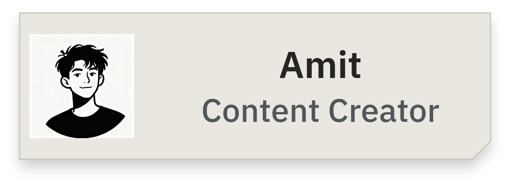
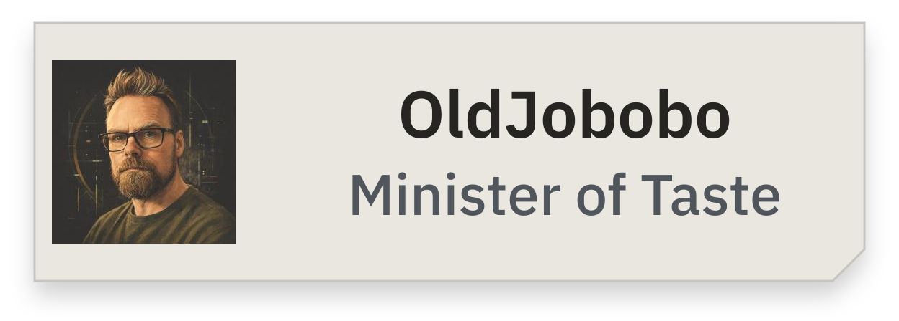
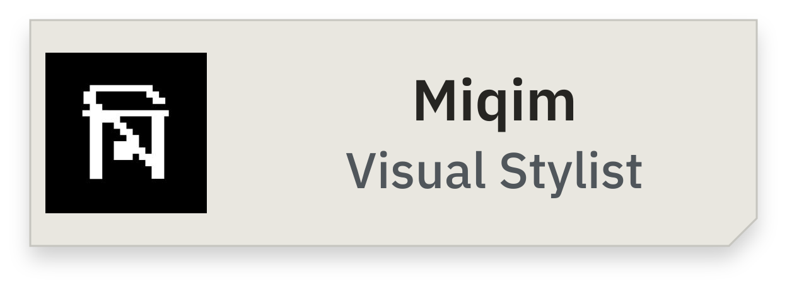
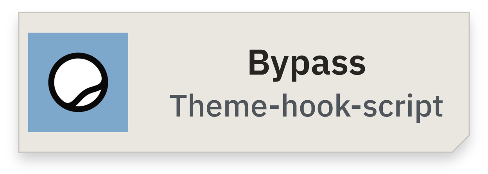
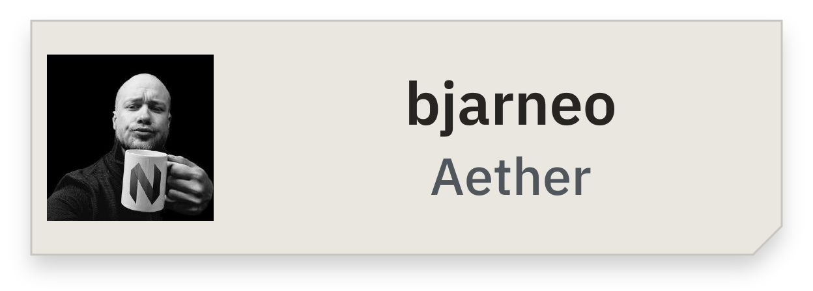
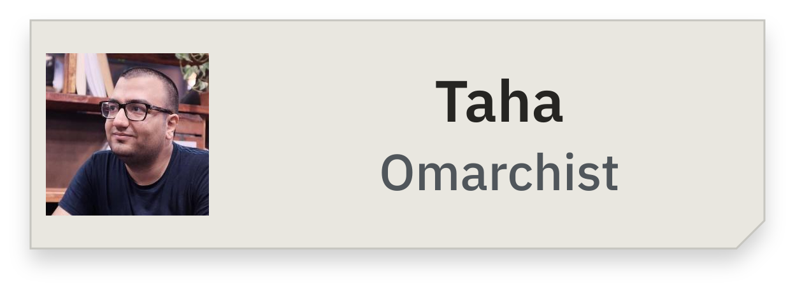
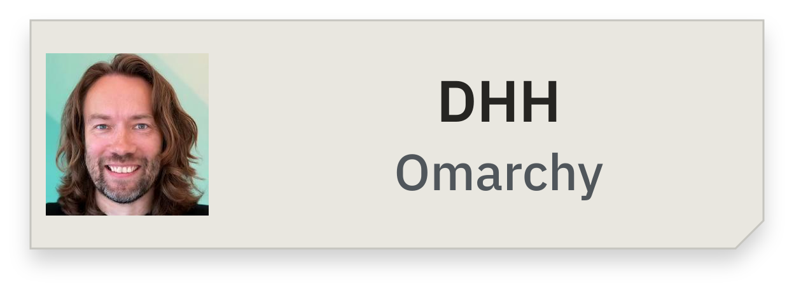
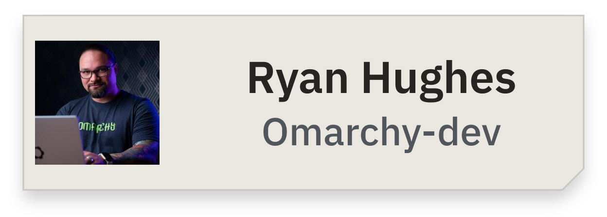

<!-- Generated from folio/ by scripts/export_profile.py --write. -->
<!-- Generated by scripts/build_folio.py. One acknowledgement per row. -->

<a href="https://github.com/HANCORE-linux">← Back to profile</a>

<picture><source media="(prefers-color-scheme: dark)" srcset="./folio/assets/label-acknowledgements-dark.png" /></picture>

<a href="https://github.com/vyrx-dev"><picture><source media="(prefers-color-scheme: dark)" srcset="./folio/assets/thanks-amit-dark.png" /></picture></a>

<a href="https://github.com/OldJobobo"><picture><source media="(prefers-color-scheme: dark)" srcset="./folio/assets/thanks-oldjobobo-dark.png" /></picture></a>

<a href="https://github.com/tahfizhabib"><picture><source media="(prefers-color-scheme: dark)" srcset="./folio/assets/thanks-miqim-dark.png" /></picture></a>

<a href="https://github.com/imbypass/omarchy-theme-hook"><picture><source media="(prefers-color-scheme: dark)" srcset="./folio/assets/thanks-bypass-dark.png" /></picture></a>

<a href="https://github.com/bjarneo/aether"><picture><source media="(prefers-color-scheme: dark)" srcset="./folio/assets/thanks-bjarneo-dark.png" /></picture></a>

<a href="https://github.com/tahayvr/omarchist"><picture><source media="(prefers-color-scheme: dark)" srcset="./folio/assets/thanks-taha-dark.png" /></picture></a>

<a href="https://github.com/dhh"><picture><source media="(prefers-color-scheme: dark)" srcset="./folio/assets/thanks-dhh-dark.png" /></picture></a>

<a href="https://github.com/ryanrhughes"><picture><source media="(prefers-color-scheme: dark)" srcset="./folio/assets/thanks-ryan-hughes-dark.png" /></picture></a>

