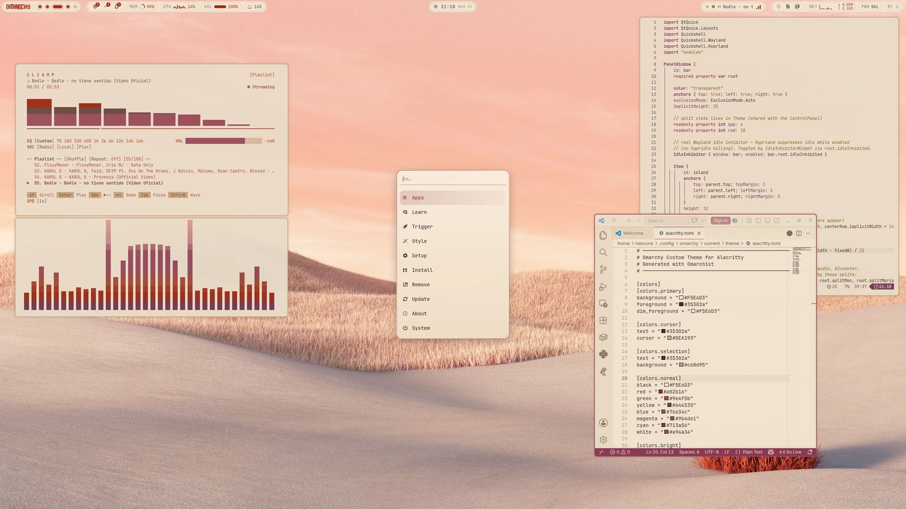
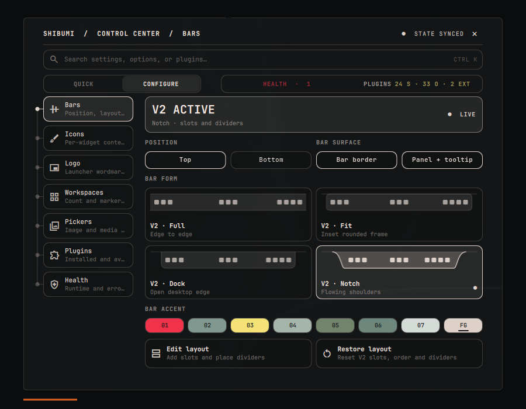

  <picture>
    <source media="(prefers-color-scheme: dark)" srcset="./assets/signature-dark.png" />
    
  </picture>

Linux interfaces, made personal.

<strong>Rose of Dune</strong> &nbsp; Desktop theme · <a href="https://github.com/HANCORE-linux/omarchy-roseofdune-theme">Explore ↗</a>

 

### Shibumi Shell

One shell. A desktop that feels like yours.

Currently building · Beta · Omarchy Quattro <a href="https://github.com/HANCORE-linux/Shibumi-Shell">Explore Shibumi ↗</a>

 

<a href="https://github.com/HANCORE-linux/waybar-themes">Waybar</a> &nbsp; / &nbsp; <a href="https://github.com/HANCORE-linux/quickshell-dots">Rise</a> &nbsp; / &nbsp; <a href="../THEMES.md">Theme archive</a>

