<!-- Generated by scripts/build_theme_registers.py. Native GitHub Markdown. -->

<a href="https://github.com/HANCORE-linux">← Back to profile</a>

<picture><source media="(min-width: 1280px) and (prefers-color-scheme: dark)" srcset="./assets/connected-archive-head-dark.png" width="792" height="96" /><source media="(min-width: 1280px) and (prefers-color-scheme: light)" srcset="./assets/connected-archive-head-light.png" width="792" height="96" /><source media="(prefers-color-scheme: dark)" srcset="./assets/label-archive-dark.png" />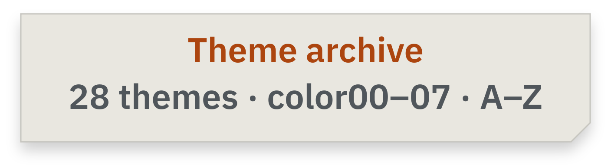</picture> 
<a href="https://github.com/HANCORE-linux/omarchy-banish-theme"><picture><source media="(min-width: 1280px) and (prefers-color-scheme: dark)" srcset="./collection/assets/connected-banish-dark.svg" width="396" height="335" /><source media="(min-width: 1280px) and (prefers-color-scheme: light)" srcset="./collection/assets/connected-banish-light.svg" width="396" height="335" /><source media="(prefers-color-scheme: dark)" srcset="./collection/assets/spaced-banish-dark.svg" />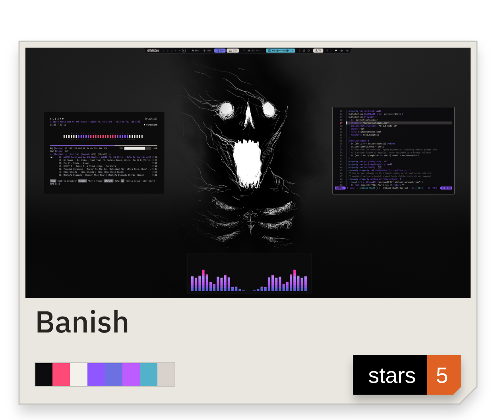</picture></a><a href="https://github.com/HANCORE-linux/omarchy-batou-theme"><picture><source media="(min-width: 1280px) and (prefers-color-scheme: dark)" srcset="./collection/assets/connected-batou-dark.svg" width="396" height="335" /><source media="(min-width: 1280px) and (prefers-color-scheme: light)" srcset="./collection/assets/connected-batou-light.svg" width="396" height="335" /><source media="(prefers-color-scheme: dark)" srcset="./collection/assets/spaced-batou-dark.svg" />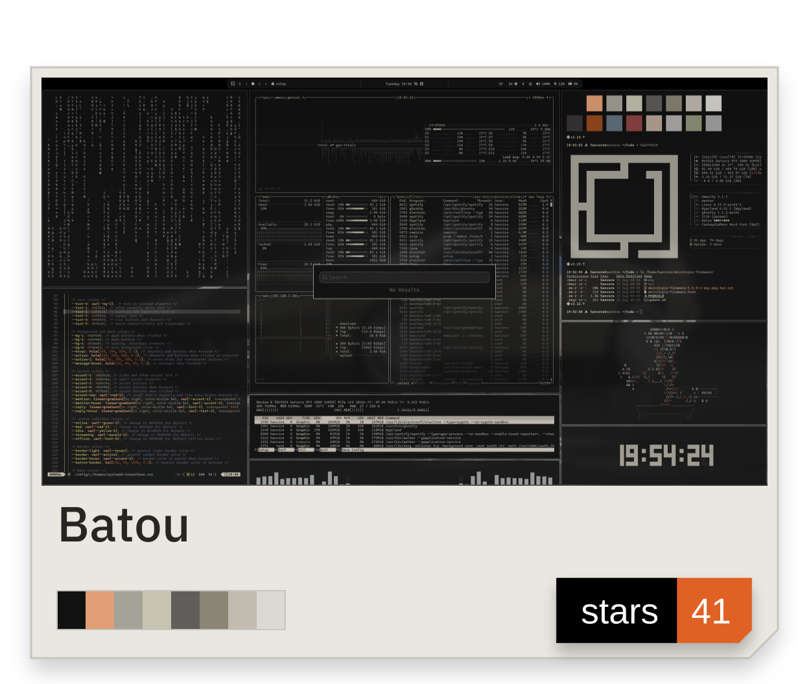</picture></a> 
<a href="https://github.com/HANCORE-linux/omarchy-blackgold-theme"><picture><source media="(min-width: 1280px) and (prefers-color-scheme: dark)" srcset="./collection/assets/connected-blackgold-dark.svg" width="396" height="335" /><source media="(min-width: 1280px) and (prefers-color-scheme: light)" srcset="./collection/assets/connected-blackgold-light.svg" width="396" height="335" /><source media="(prefers-color-scheme: dark)" srcset="./collection/assets/spaced-blackgold-dark.svg" />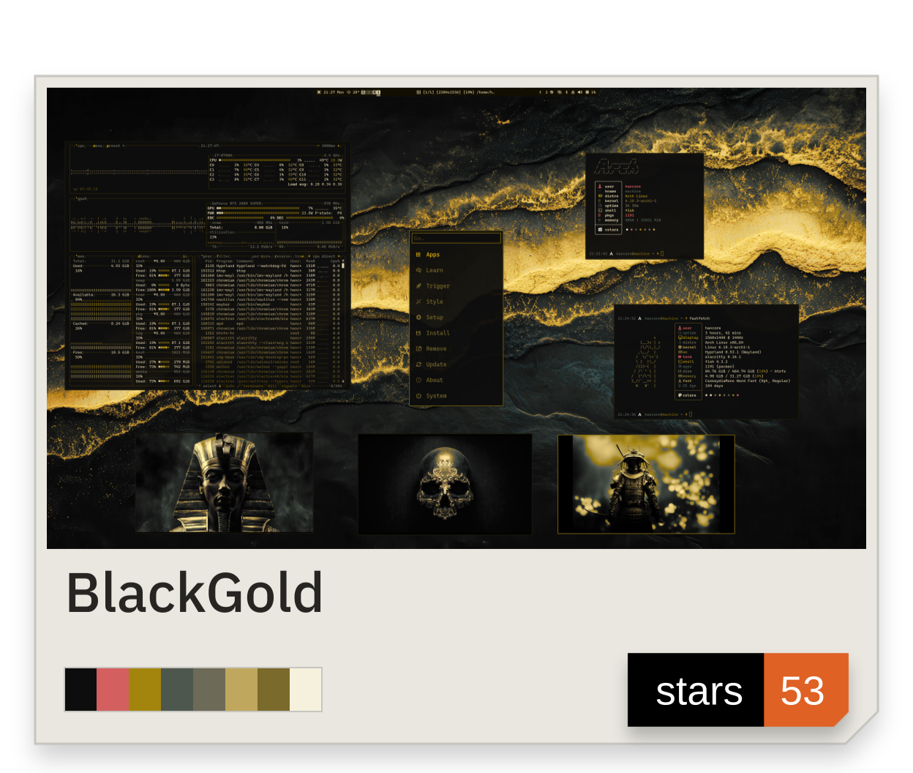</picture></a><a href="https://github.com/HANCORE-linux/omarchy-blackmoney-theme"><picture><source media="(min-width: 1280px) and (prefers-color-scheme: dark)" srcset="./collection/assets/connected-blackmoney-dark.svg" width="396" height="335" /><source media="(min-width: 1280px) and (prefers-color-scheme: light)" srcset="./collection/assets/connected-blackmoney-light.svg" width="396" height="335" /><source media="(prefers-color-scheme: dark)" srcset="./collection/assets/spaced-blackmoney-dark.svg" />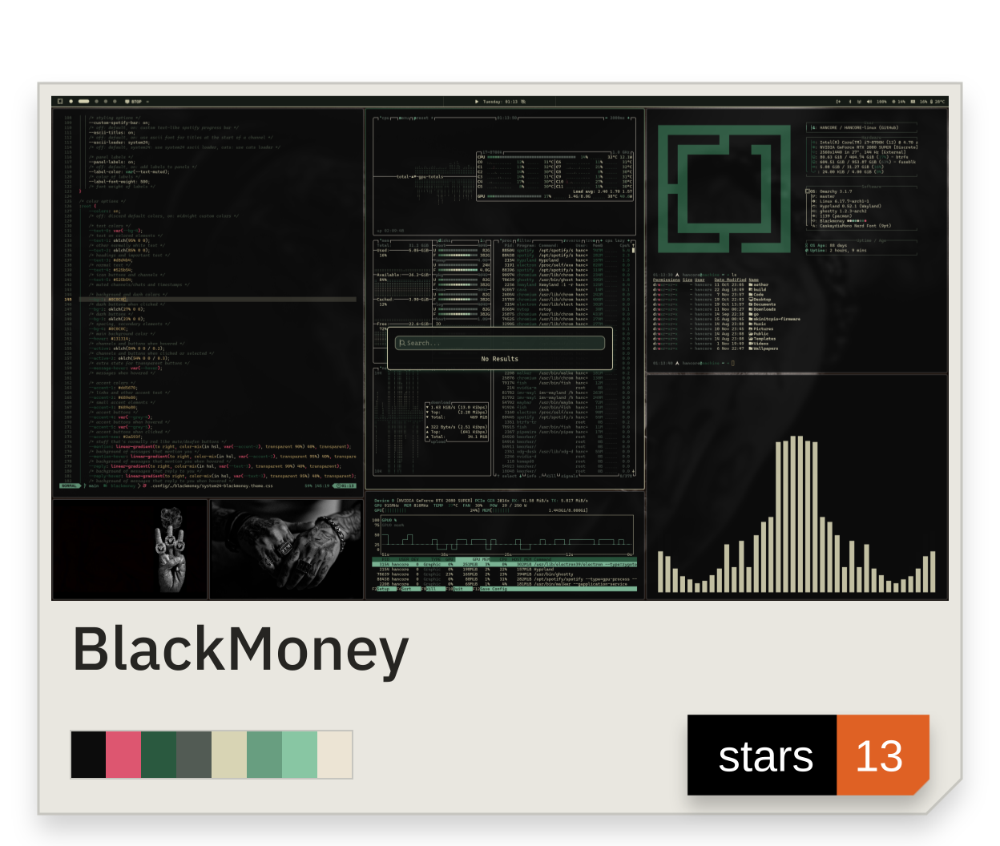</picture></a> 
<a href="https://github.com/HANCORE-linux/omarchy-blackturq-theme"><picture><source media="(min-width: 1280px) and (prefers-color-scheme: dark)" srcset="./collection/assets/connected-blackturq-dark.svg" width="396" height="335" /><source media="(min-width: 1280px) and (prefers-color-scheme: light)" srcset="./collection/assets/connected-blackturq-light.svg" width="396" height="335" /><source media="(prefers-color-scheme: dark)" srcset="./collection/assets/spaced-blackturq-dark.svg" />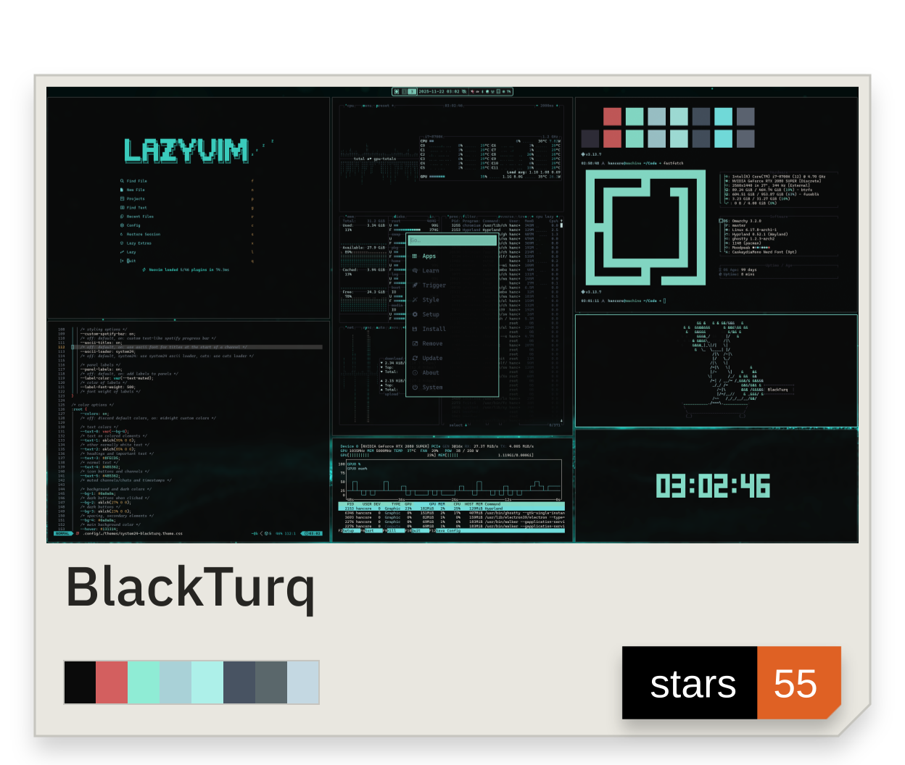</picture></a><a href="https://github.com/HANCORE-linux/omarchy-demon-theme"><picture><source media="(min-width: 1280px) and (prefers-color-scheme: dark)" srcset="./collection/assets/connected-demon-dark.svg" width="396" height="335" /><source media="(min-width: 1280px) and (prefers-color-scheme: light)" srcset="./collection/assets/connected-demon-light.svg" width="396" height="335" /><source media="(prefers-color-scheme: dark)" srcset="./collection/assets/spaced-demon-dark.svg" />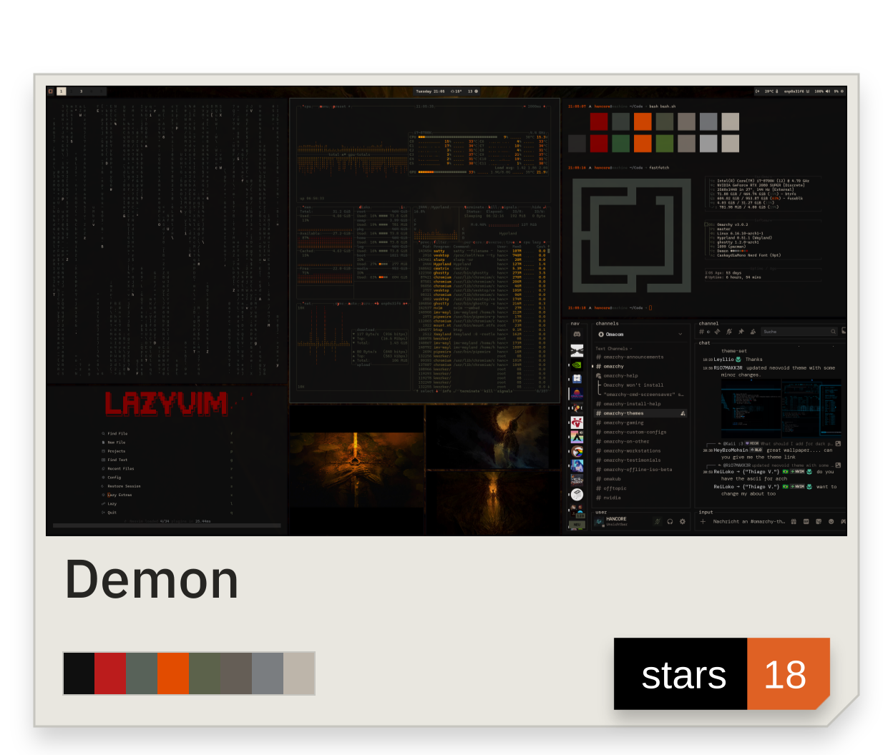</picture></a> 
<a href="https://github.com/HANCORE-linux/omarchy-dos-moos-theme"><picture><source media="(min-width: 1280px) and (prefers-color-scheme: dark)" srcset="./collection/assets/connected-dos-moos-dark.svg" width="396" height="335" /><source media="(min-width: 1280px) and (prefers-color-scheme: light)" srcset="./collection/assets/connected-dos-moos-light.svg" width="396" height="335" /><source media="(prefers-color-scheme: dark)" srcset="./collection/assets/spaced-dos-moos-dark.svg" />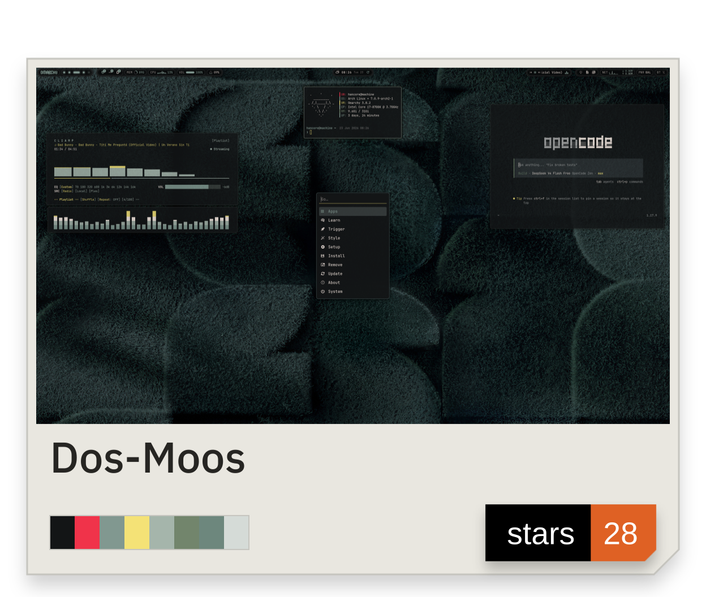</picture></a><a href="https://github.com/HANCORE-linux/omarchy-greek-noir-theme"><picture><source media="(min-width: 1280px) and (prefers-color-scheme: dark)" srcset="./collection/assets/connected-greek-noir-dark.svg" width="396" height="335" /><source media="(min-width: 1280px) and (prefers-color-scheme: light)" srcset="./collection/assets/connected-greek-noir-light.svg" width="396" height="335" /><source media="(prefers-color-scheme: dark)" srcset="./collection/assets/spaced-greek-noir-dark.svg" />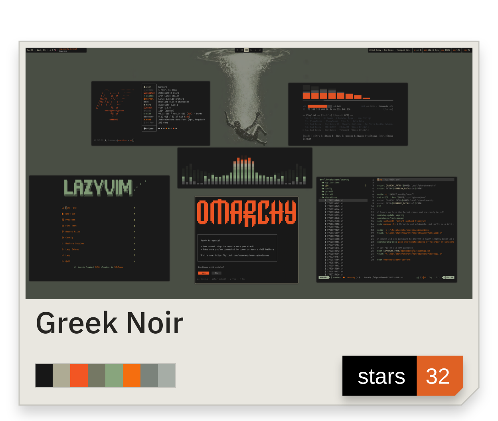</picture></a> 
<a href="https://github.com/HANCORE-linux/omarchy-harbor-theme"><picture><source media="(min-width: 1280px) and (prefers-color-scheme: dark)" srcset="./collection/assets/connected-harbor-dark.svg" width="396" height="335" /><source media="(min-width: 1280px) and (prefers-color-scheme: light)" srcset="./collection/assets/connected-harbor-light.svg" width="396" height="335" /><source media="(prefers-color-scheme: dark)" srcset="./collection/assets/spaced-harbor-dark.svg" />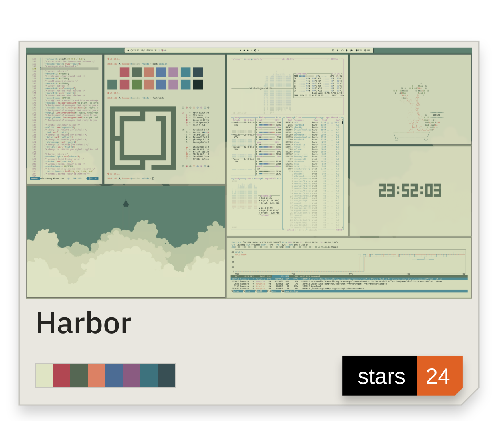</picture></a><a href="https://github.com/HANCORE-linux/omarchy-harbordark-theme"><picture><source media="(min-width: 1280px) and (prefers-color-scheme: dark)" srcset="./collection/assets/connected-harbordark-dark.svg" width="396" height="335" /><source media="(min-width: 1280px) and (prefers-color-scheme: light)" srcset="./collection/assets/connected-harbordark-light.svg" width="396" height="335" /><source media="(prefers-color-scheme: dark)" srcset="./collection/assets/spaced-harbordark-dark.svg" />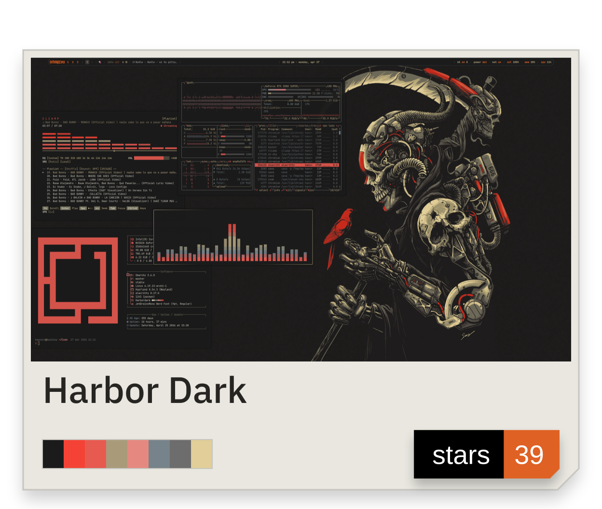</picture></a> 
<a href="https://github.com/HANCORE-linux/omarchy-inkypinky-theme"><picture><source media="(min-width: 1280px) and (prefers-color-scheme: dark)" srcset="./collection/assets/connected-inkypinky-dark.svg" width="396" height="335" /><source media="(min-width: 1280px) and (prefers-color-scheme: light)" srcset="./collection/assets/connected-inkypinky-light.svg" width="396" height="335" /><source media="(prefers-color-scheme: dark)" srcset="./collection/assets/spaced-inkypinky-dark.svg" />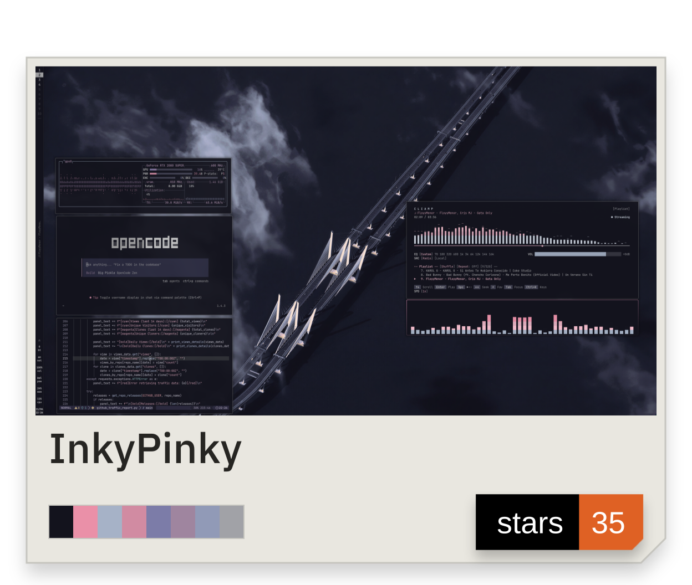</picture></a><a href="https://github.com/HANCORE-linux/omarchy-kanso-theme"><picture><source media="(min-width: 1280px) and (prefers-color-scheme: dark)" srcset="./collection/assets/connected-kanso-dark.svg" width="396" height="335" /><source media="(min-width: 1280px) and (prefers-color-scheme: light)" srcset="./collection/assets/connected-kanso-light.svg" width="396" height="335" /><source media="(prefers-color-scheme: dark)" srcset="./collection/assets/spaced-kanso-dark.svg" />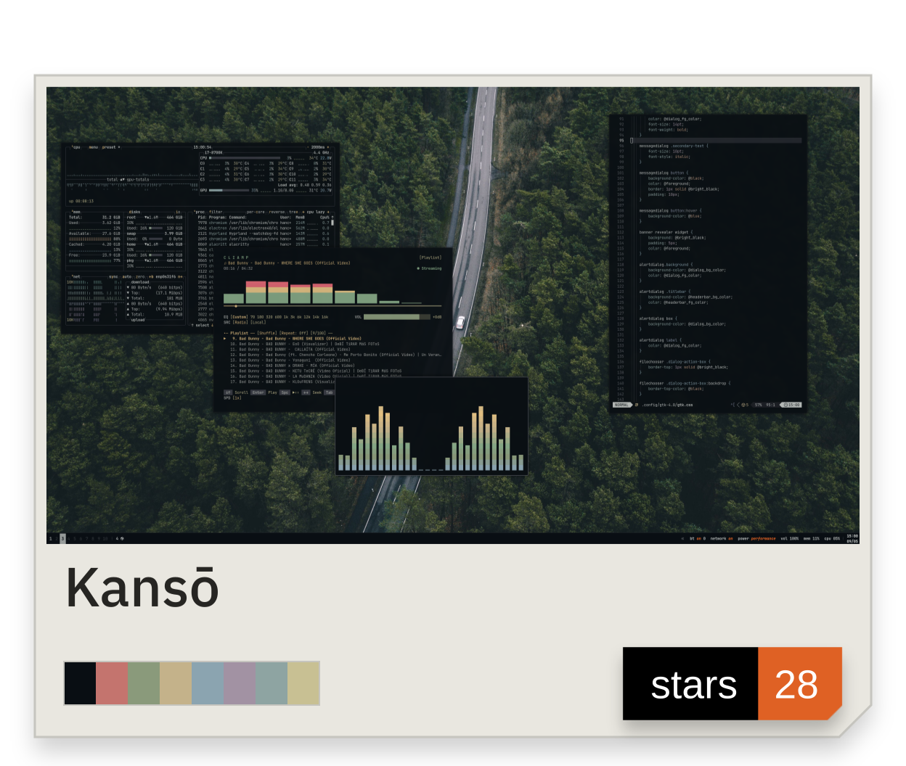</picture></a> 
<a href="https://github.com/HANCORE-linux/omarchy-labra-theme"><picture><source media="(min-width: 1280px) and (prefers-color-scheme: dark)" srcset="./collection/assets/connected-labra-dark.svg" width="396" height="335" /><source media="(min-width: 1280px) and (prefers-color-scheme: light)" srcset="./collection/assets/connected-labra-light.svg" width="396" height="335" /><source media="(prefers-color-scheme: dark)" srcset="./collection/assets/spaced-labra-dark.svg" />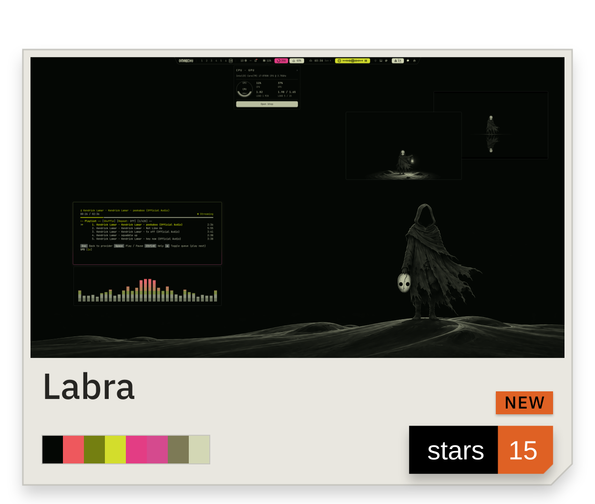</picture></a><a href="https://github.com/HANCORE-linux/omarchy-lasthorizon-theme"><picture><source media="(min-width: 1280px) and (prefers-color-scheme: dark)" srcset="./collection/assets/connected-lasthorizon-dark.svg" width="396" height="335" /><source media="(min-width: 1280px) and (prefers-color-scheme: light)" srcset="./collection/assets/connected-lasthorizon-light.svg" width="396" height="335" /><source media="(prefers-color-scheme: dark)" srcset="./collection/assets/spaced-lasthorizon-dark.svg" />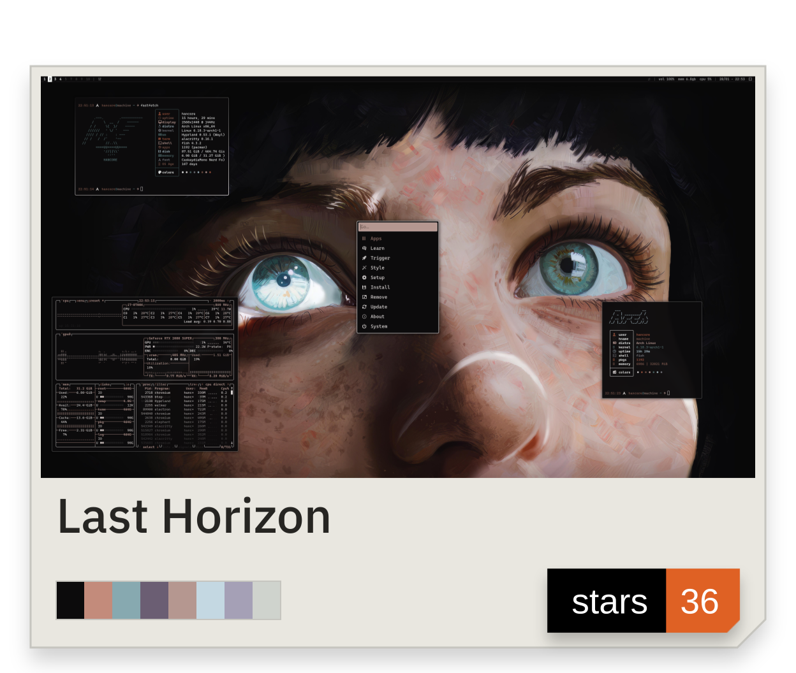</picture></a> 
<a href="https://github.com/HANCORE-linux/omarchy-mechanoonna-theme"><picture><source media="(min-width: 1280px) and (prefers-color-scheme: dark)" srcset="./collection/assets/connected-mechanoonna-dark.svg" width="396" height="335" /><source media="(min-width: 1280px) and (prefers-color-scheme: light)" srcset="./collection/assets/connected-mechanoonna-light.svg" width="396" height="335" /><source media="(prefers-color-scheme: dark)" srcset="./collection/assets/spaced-mechanoonna-dark.svg" />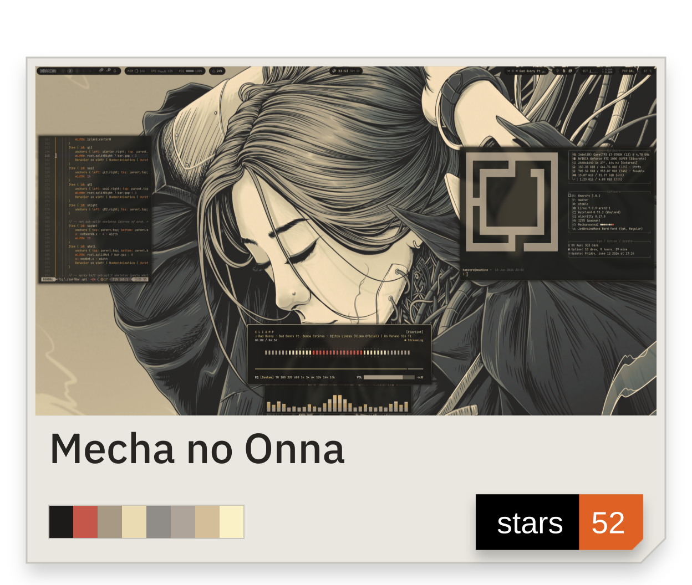</picture></a><a href="https://github.com/HANCORE-linux/omarchy-moodpeak-theme"><picture><source media="(min-width: 1280px) and (prefers-color-scheme: dark)" srcset="./collection/assets/connected-moodpeak-dark.svg" width="396" height="335" /><source media="(min-width: 1280px) and (prefers-color-scheme: light)" srcset="./collection/assets/connected-moodpeak-light.svg" width="396" height="335" /><source media="(prefers-color-scheme: dark)" srcset="./collection/assets/spaced-moodpeak-dark.svg" />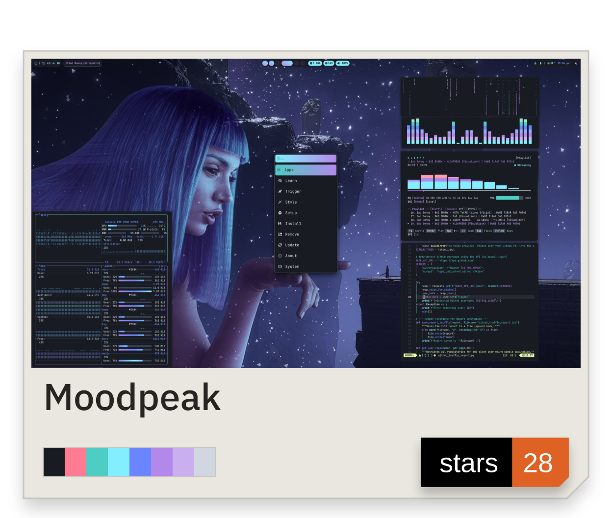</picture></a> 
<a href="https://github.com/HANCORE-linux/omarchy-oxford-theme"><picture><source media="(min-width: 1280px) and (prefers-color-scheme: dark)" srcset="./collection/assets/connected-oxford-dark.svg" width="396" height="335" /><source media="(min-width: 1280px) and (prefers-color-scheme: light)" srcset="./collection/assets/connected-oxford-light.svg" width="396" height="335" /><source media="(prefers-color-scheme: dark)" srcset="./collection/assets/spaced-oxford-dark.svg" />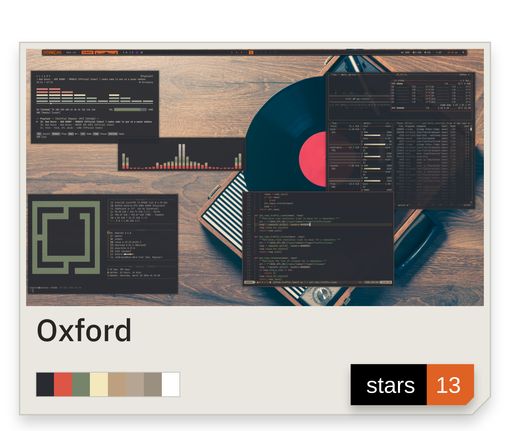</picture></a><a href="https://github.com/HANCORE-linux/omarchy-oxocarbon-theme"><picture><source media="(min-width: 1280px) and (prefers-color-scheme: dark)" srcset="./collection/assets/connected-oxocarbon-dark.svg" width="396" height="335" /><source media="(min-width: 1280px) and (prefers-color-scheme: light)" srcset="./collection/assets/connected-oxocarbon-light.svg" width="396" height="335" /><source media="(prefers-color-scheme: dark)" srcset="./collection/assets/spaced-oxocarbon-dark.svg" />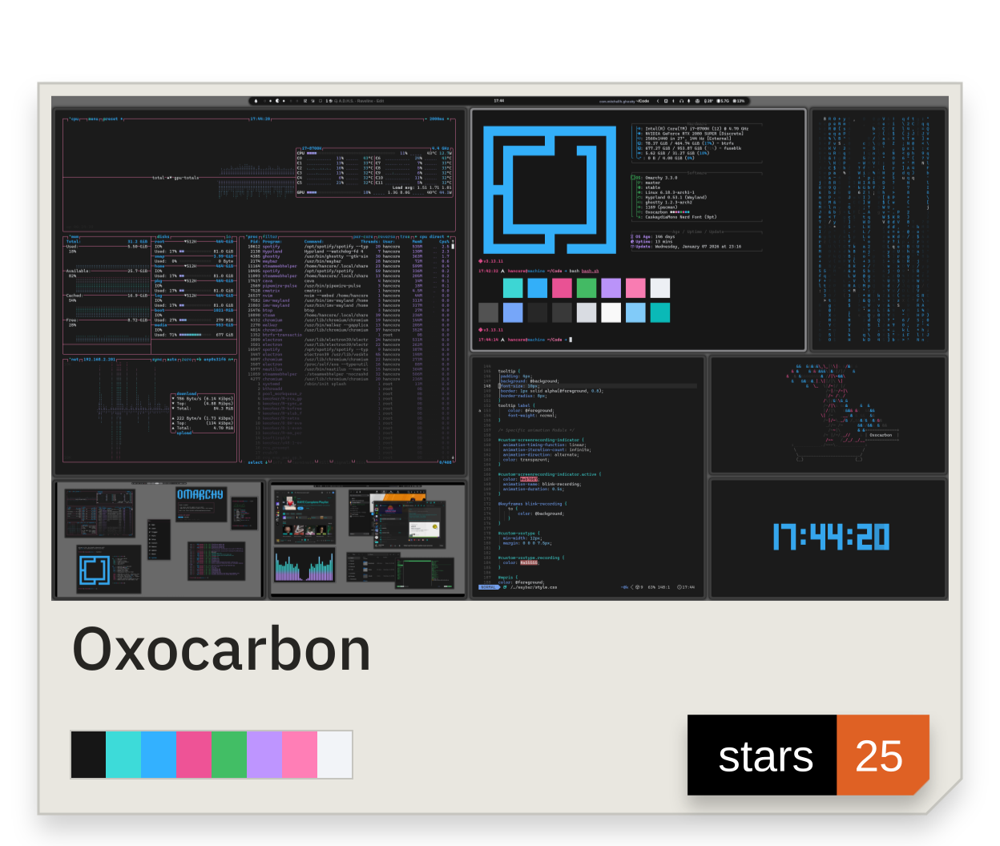</picture></a> 
<a href="https://github.com/HANCORE-linux/omarchy-roseofdune-theme"><picture><source media="(min-width: 1280px) and (prefers-color-scheme: dark)" srcset="./collection/assets/connected-roseofdune-dark.svg" width="396" height="335" /><source media="(min-width: 1280px) and (prefers-color-scheme: light)" srcset="./collection/assets/connected-roseofdune-light.svg" width="396" height="335" /><source media="(prefers-color-scheme: dark)" srcset="./collection/assets/spaced-roseofdune-dark.svg" />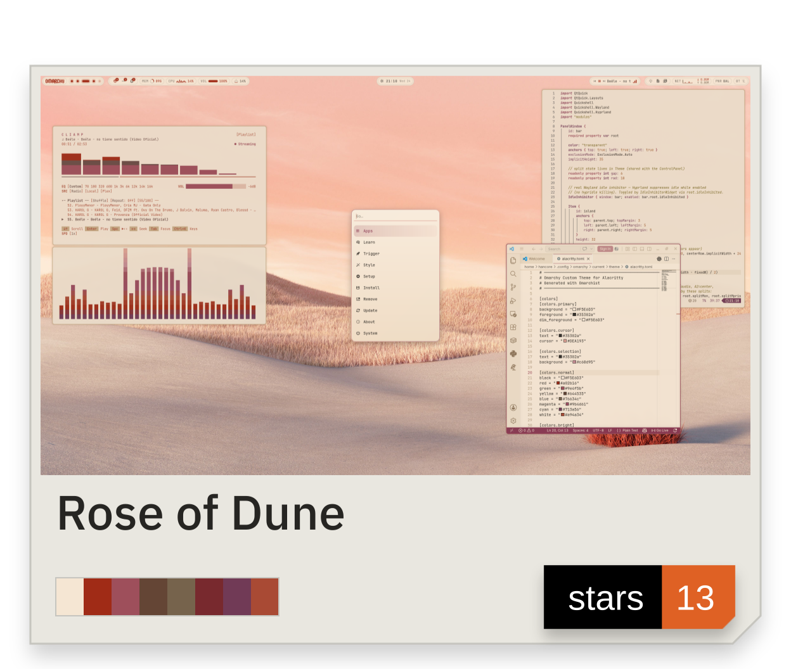</picture></a><a href="https://github.com/HANCORE-linux/omarchy-ryu-theme"><picture><source media="(min-width: 1280px) and (prefers-color-scheme: dark)" srcset="./collection/assets/connected-ryu-dark.svg" width="396" height="335" /><source media="(min-width: 1280px) and (prefers-color-scheme: light)" srcset="./collection/assets/connected-ryu-light.svg" width="396" height="335" /><source media="(prefers-color-scheme: dark)" srcset="./collection/assets/spaced-ryu-dark.svg" />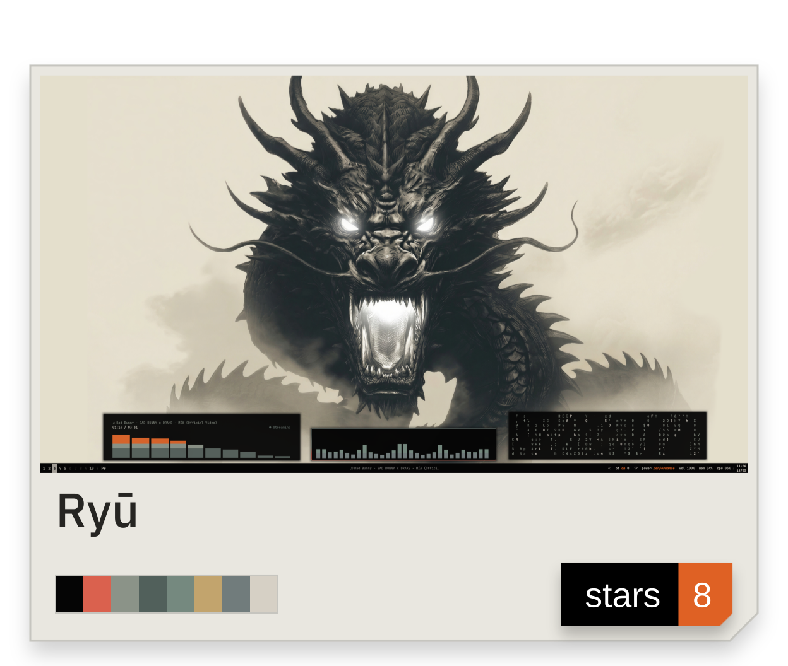</picture></a> 
<a href="https://github.com/HANCORE-linux/omarchy-saga-theme"><picture><source media="(min-width: 1280px) and (prefers-color-scheme: dark)" srcset="./collection/assets/connected-saga-dark.svg" width="396" height="335" /><source media="(min-width: 1280px) and (prefers-color-scheme: light)" srcset="./collection/assets/connected-saga-light.svg" width="396" height="335" /><source media="(prefers-color-scheme: dark)" srcset="./collection/assets/spaced-saga-dark.svg" />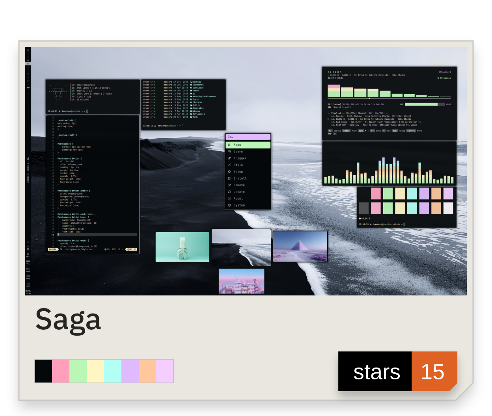</picture></a><a href="https://github.com/HANCORE-linux/omarchy-sapphire-theme"><picture><source media="(min-width: 1280px) and (prefers-color-scheme: dark)" srcset="./collection/assets/connected-sapphire-dark.svg" width="396" height="335" /><source media="(min-width: 1280px) and (prefers-color-scheme: light)" srcset="./collection/assets/connected-sapphire-light.svg" width="396" height="335" /><source media="(prefers-color-scheme: dark)" srcset="./collection/assets/spaced-sapphire-dark.svg" />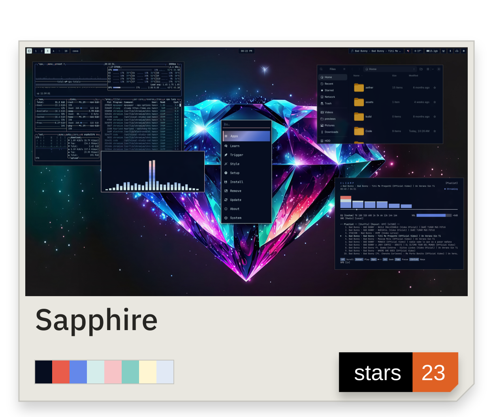</picture></a> 
<a href="https://github.com/HANCORE-linux/omarchy-shadesofjade-theme"><picture><source media="(min-width: 1280px) and (prefers-color-scheme: dark)" srcset="./collection/assets/connected-shadesofjade-dark.svg" width="396" height="335" /><source media="(min-width: 1280px) and (prefers-color-scheme: light)" srcset="./collection/assets/connected-shadesofjade-light.svg" width="396" height="335" /><source media="(prefers-color-scheme: dark)" srcset="./collection/assets/spaced-shadesofjade-dark.svg" />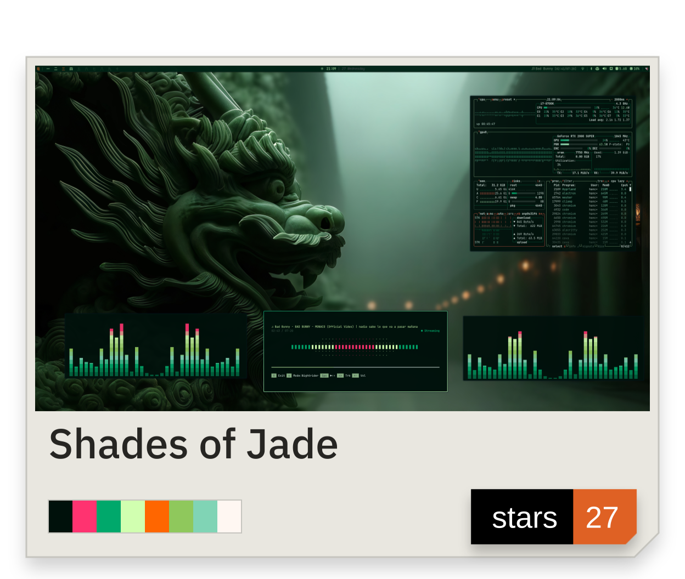</picture></a><a href="https://github.com/HANCORE-linux/omarchy-solitude-theme"><picture><source media="(min-width: 1280px) and (prefers-color-scheme: dark)" srcset="./collection/assets/connected-solitude-dark.svg" width="396" height="335" /><source media="(min-width: 1280px) and (prefers-color-scheme: light)" srcset="./collection/assets/connected-solitude-light.svg" width="396" height="335" /><source media="(prefers-color-scheme: dark)" srcset="./collection/assets/spaced-solitude-dark.svg" />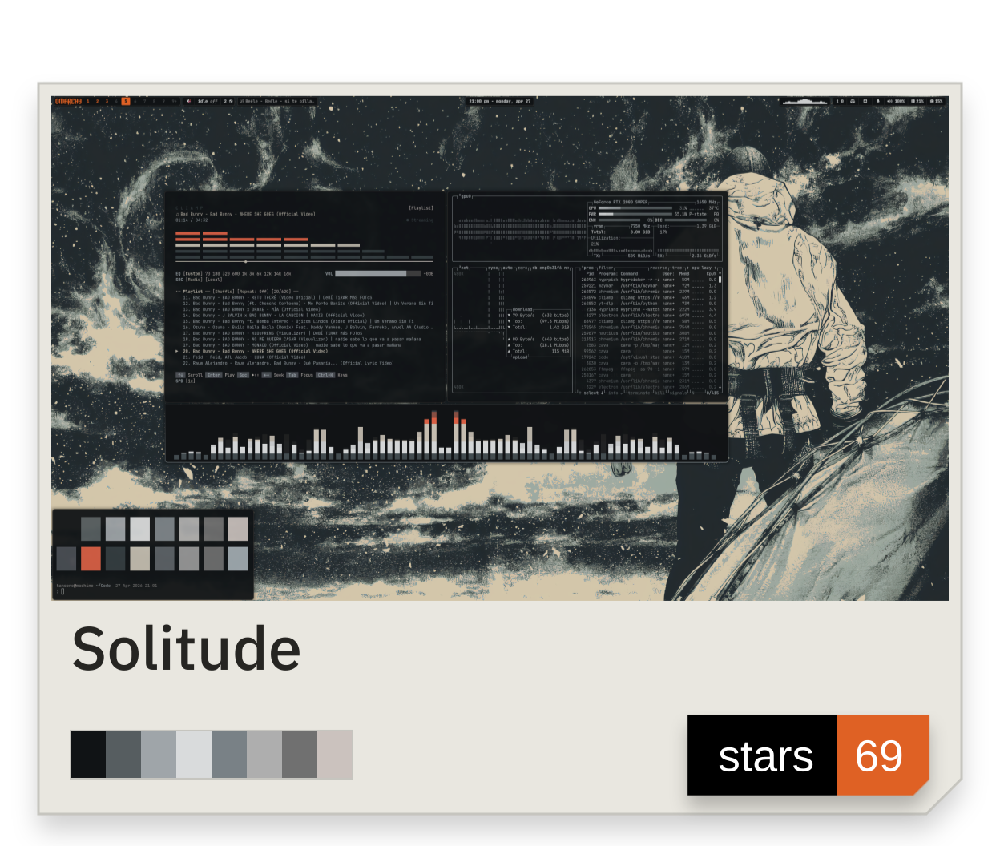</picture></a> 
<a href="https://github.com/HANCORE-linux/omarchy-thegreek-theme"><picture><source media="(min-width: 1280px) and (prefers-color-scheme: dark)" srcset="./collection/assets/connected-thegreek-dark.svg" width="396" height="335" /><source media="(min-width: 1280px) and (prefers-color-scheme: light)" srcset="./collection/assets/connected-thegreek-light.svg" width="396" height="335" /><source media="(prefers-color-scheme: dark)" srcset="./collection/assets/spaced-thegreek-dark.svg" />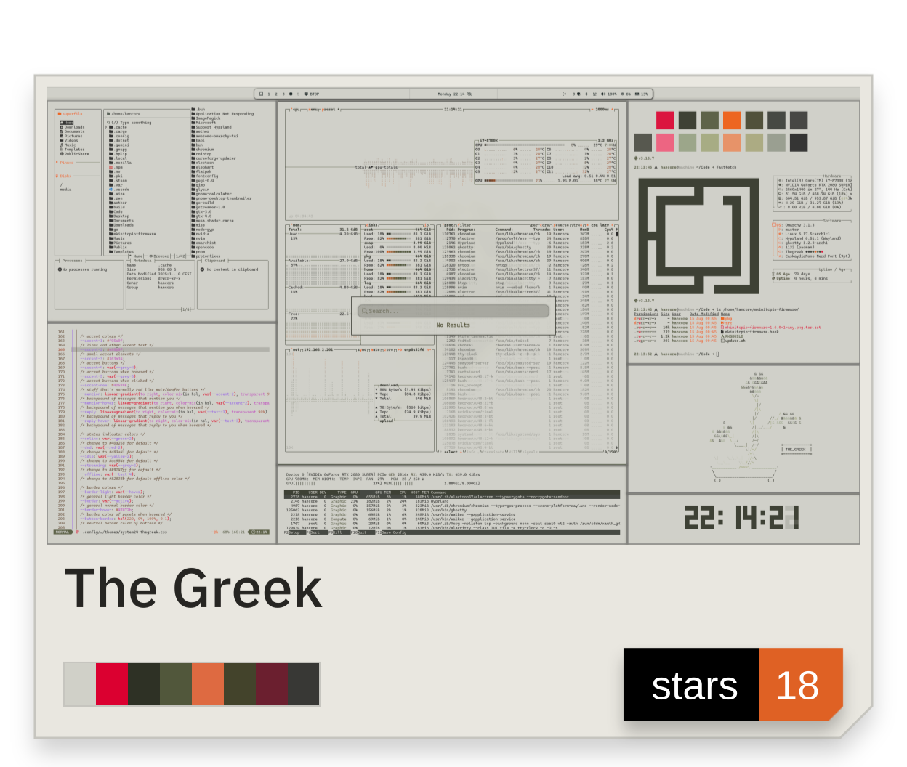</picture></a><a href="https://github.com/HANCORE-linux/omarchy-turbonite-theme"><picture><source media="(min-width: 1280px) and (prefers-color-scheme: dark)" srcset="./collection/assets/connected-turbonite-dark.svg" width="396" height="335" /><source media="(min-width: 1280px) and (prefers-color-scheme: light)" srcset="./collection/assets/connected-turbonite-light.svg" width="396" height="335" /><source media="(prefers-color-scheme: dark)" srcset="./collection/assets/spaced-turbonite-dark.svg" />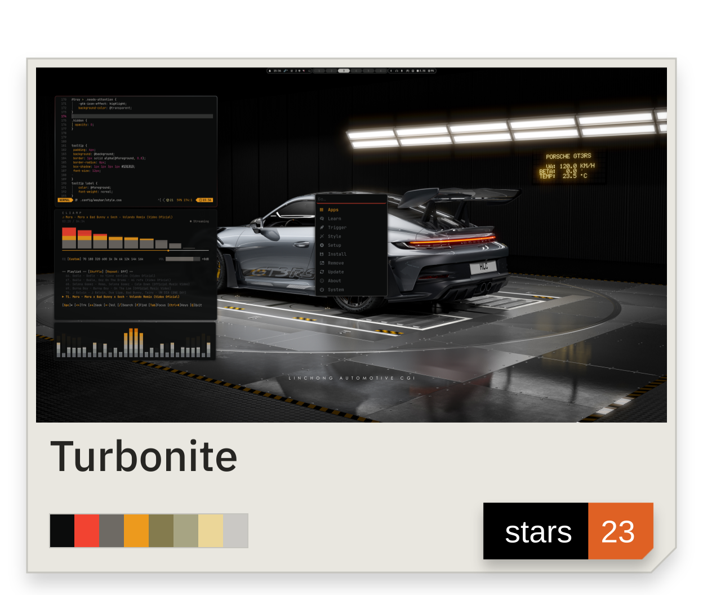</picture></a> 
<a href="https://github.com/HANCORE-linux/omarchy-velvetnight-theme"><picture><source media="(min-width: 1280px) and (prefers-color-scheme: dark)" srcset="./collection/assets/connected-velvetnight-dark.svg" width="396" height="357" /><source media="(min-width: 1280px) and (prefers-color-scheme: light)" srcset="./collection/assets/connected-velvetnight-light.svg" width="396" height="357" /><source media="(prefers-color-scheme: dark)" srcset="./collection/assets/spaced-velvetnight-dark.svg" />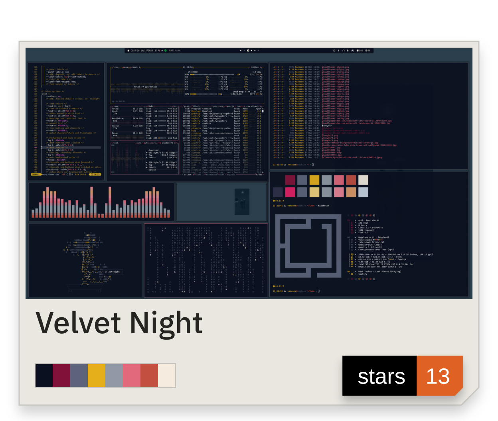</picture></a><a href="https://github.com/HANCORE-linux/omarchy-whitegold-theme"><picture><source media="(min-width: 1280px) and (prefers-color-scheme: dark)" srcset="./collection/assets/connected-whitegold-dark.svg" width="396" height="357" /><source media="(min-width: 1280px) and (prefers-color-scheme: light)" srcset="./collection/assets/connected-whitegold-light.svg" width="396" height="357" /><source media="(prefers-color-scheme: dark)" srcset="./collection/assets/spaced-whitegold-dark.svg" />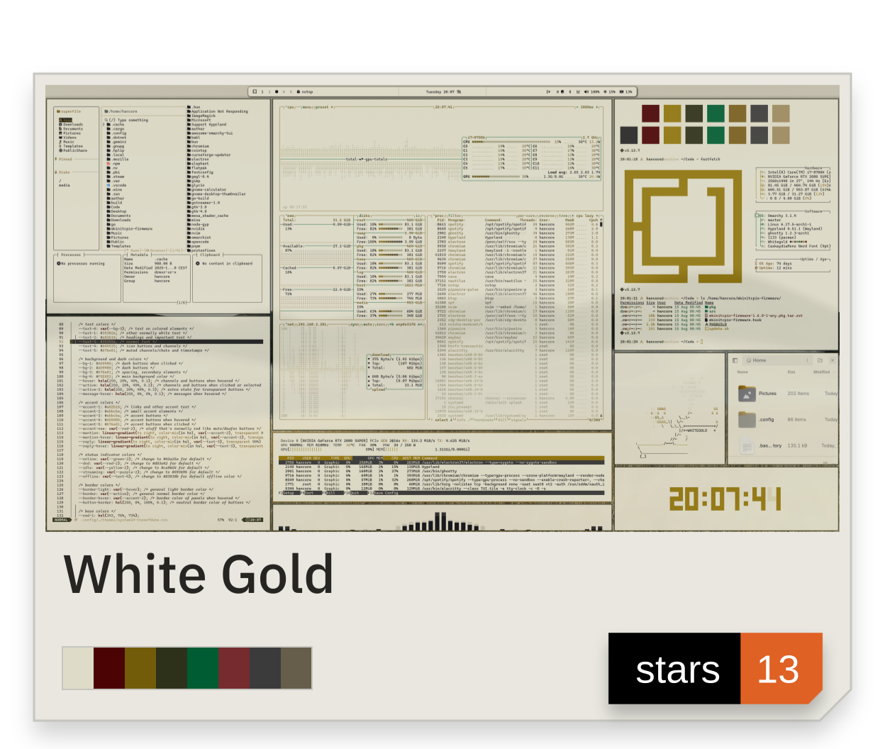</picture></a>

<a href="https://github.com/HANCORE-linux">← Back to profile</a>

