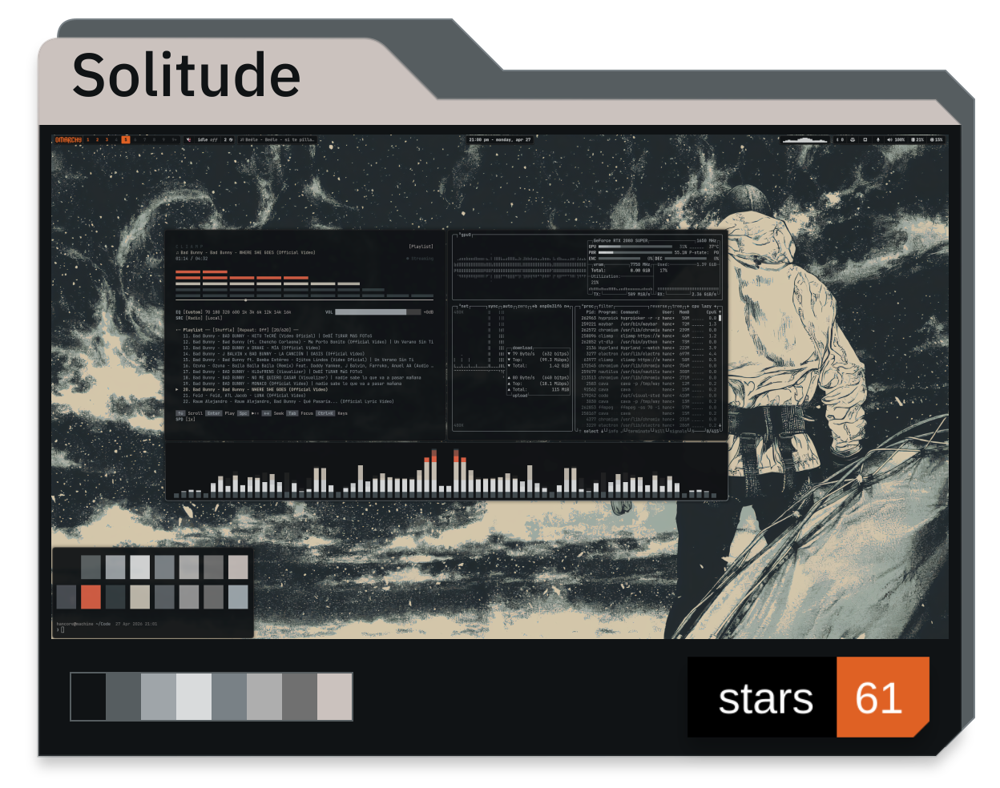
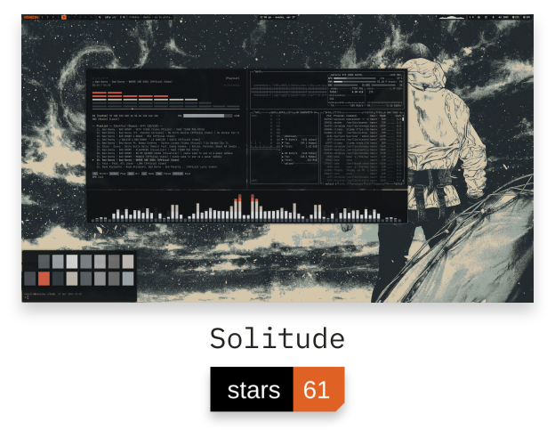

SOLITUDE / REGISTERSTUDIE

<a href="https://github.com/HANCORE-linux/omarchy-solitude-theme"><picture><source media="(prefers-color-scheme: dark)" srcset="./assets/solitude-dark.png" /></picture></a>

Vergleich bei 248 px · bisher / Register

  <a href="https://github.com/HANCORE-linux/omarchy-solitude-theme"><picture><source media="(prefers-color-scheme: dark)" srcset="../../assets/popular-solitude-dark.png" /></picture></a>
  <a href="https://github.com/HANCORE-linux/omarchy-solitude-theme"><picture><source media="(prefers-color-scheme: dark)" srcset="./assets/solitude-dark.png" /></picture></a>

Originaler Desktop · echte Farben 00–07 · bestehendes Stars-Badge Ursprüngliche Einzelstudie. Die komplette Serie ist jetzt im Profil und im Theme-Archiv zu sehen.

