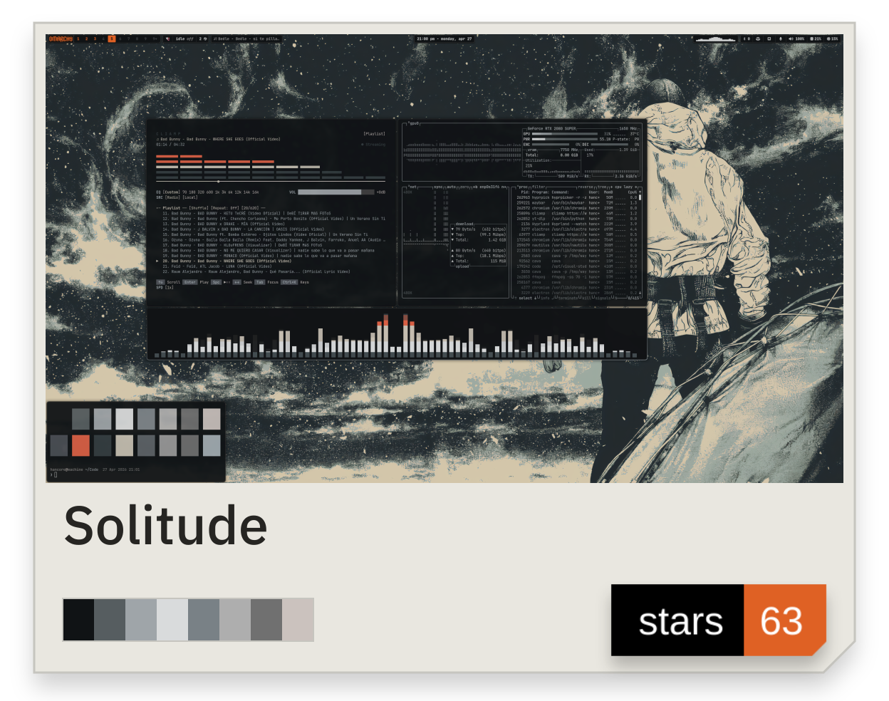
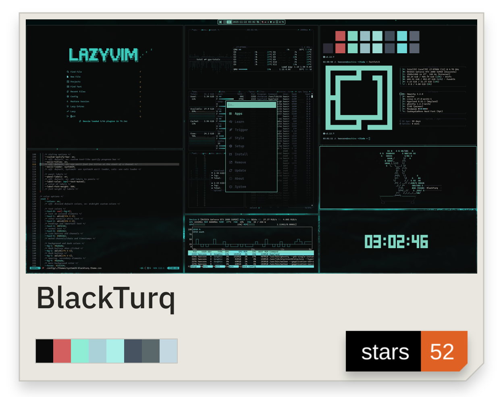
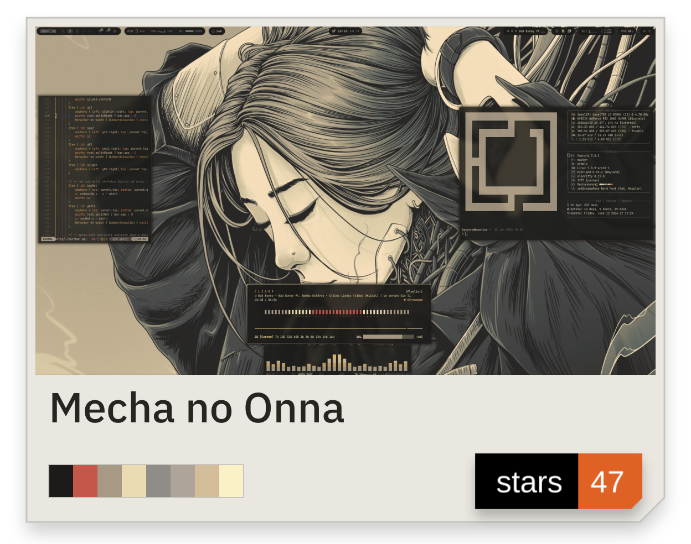
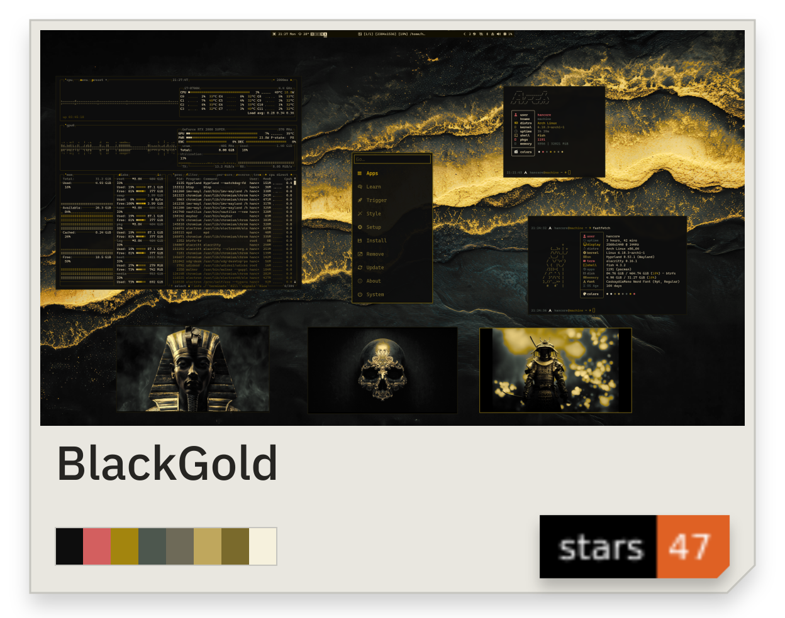
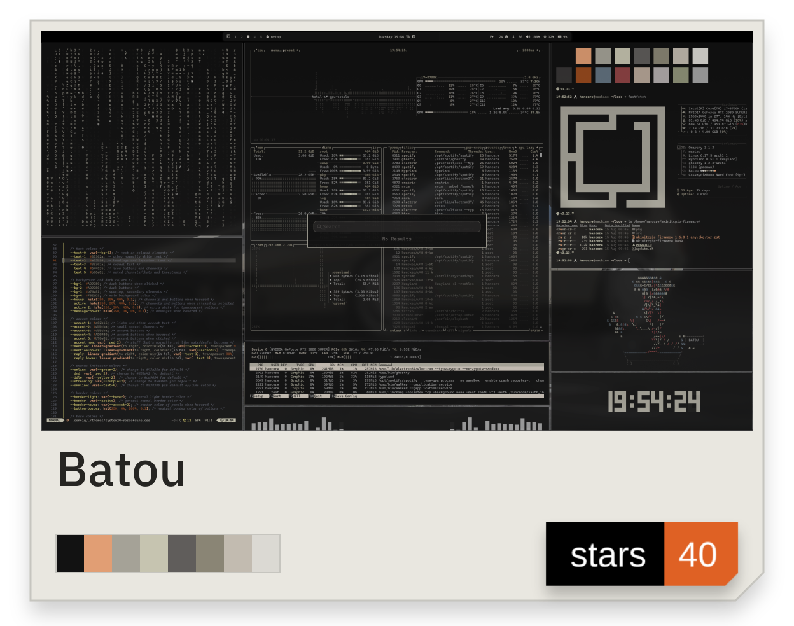
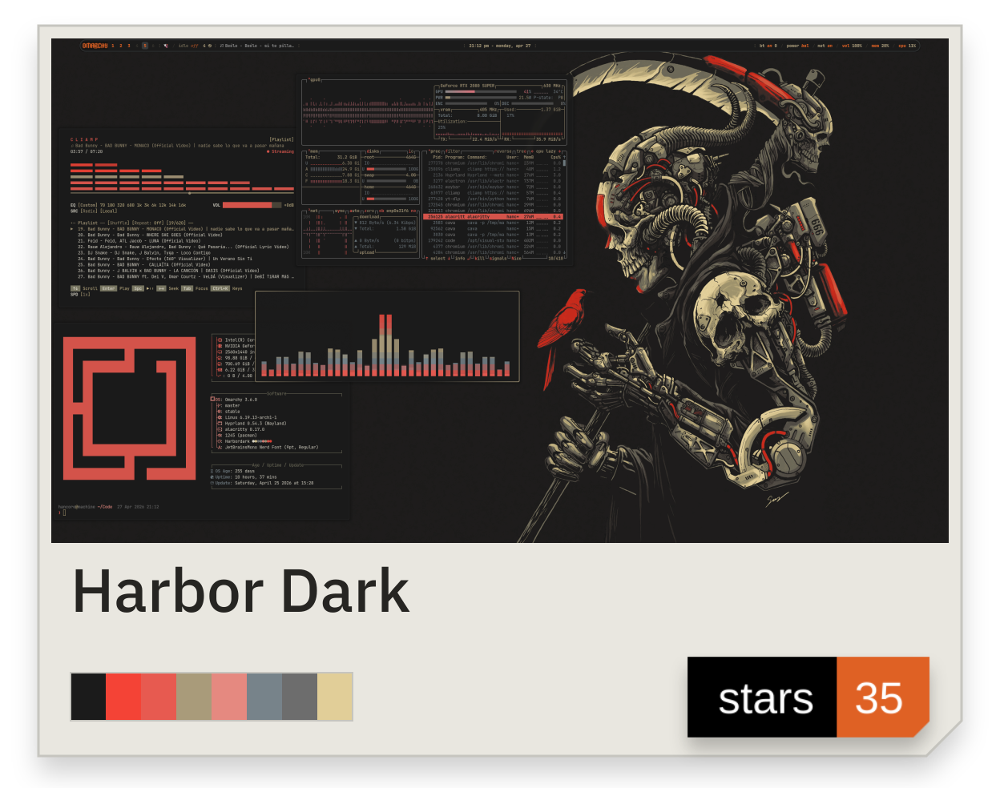

<!-- BEGIN GENERATED: identity -->

  <picture>
    <source media="(prefers-color-scheme: dark)" srcset="../../assets/wordmark-core-dark.png" />
    
  </picture>

<picture><source media="(min-width: 1280px) and (prefers-color-scheme: dark)" srcset="../../assets/bio-wide-dark.png" width="744" height="76" /><source media="(min-width: 1280px) and (prefers-color-scheme: light)" srcset="../../assets/bio-wide-light.png" width="744" height="76" /><source media="(prefers-color-scheme: dark)" srcset="../../assets/bio-narrow-dark.png" /></picture>

<picture><source media="(prefers-color-scheme: dark)" srcset="../../assets/label-subtitle-dark.png" /></picture>

<!-- END GENERATED: identity -->

<!-- BEGIN GENERATED: projects -->

<a href="https://github.com/HANCORE-linux/Shibumi-Shell"><picture><source media="(min-width: 1280px) and (prefers-color-scheme: dark)" srcset="../../assets/connected-shibumi-dark.png" width="248" height="358" /><source media="(min-width: 1280px) and (prefers-color-scheme: light)" srcset="../../assets/connected-shibumi-light.png" width="248" height="358" /><source media="(prefers-color-scheme: dark)" srcset="../../assets/shibumi-dark.png" /></picture></a><a href="https://github.com/HANCORE-linux/OmaQ"><picture><source media="(min-width: 1280px) and (prefers-color-scheme: dark)" srcset="../../assets/connected-omaq-dark.png" width="248" height="358" /><source media="(min-width: 1280px) and (prefers-color-scheme: light)" srcset="../../assets/connected-omaq-light.png" width="248" height="358" /><source media="(prefers-color-scheme: dark)" srcset="../../assets/omaq-dark.png" /></picture></a><a href="https://github.com/omacom/omarchy-plugin-marketplace"><picture><source media="(min-width: 1280px) and (prefers-color-scheme: dark)" srcset="../../assets/connected-marketplace-dark.png" width="248" height="358" /><source media="(min-width: 1280px) and (prefers-color-scheme: light)" srcset="../../assets/connected-marketplace-light.png" width="248" height="358" /><source media="(prefers-color-scheme: dark)" srcset="../../assets/marketplace-dark.png" /></picture></a> <a href="https://github.com/HANCORE-linux/waybar-themes"><picture><source media="(min-width: 1280px) and (prefers-color-scheme: dark)" srcset="../../assets/connected-info-waybar-dark.png" width="372" height="108" /><source media="(min-width: 1280px) and (prefers-color-scheme: light)" srcset="../../assets/connected-info-waybar-light.png" width="372" height="108" /><source media="(prefers-color-scheme: dark)" srcset="../../assets/info-waybar-dark.png" /></picture></a><a href="https://github.com/HANCORE-linux/quickshell-dots"><picture><source media="(min-width: 1280px) and (prefers-color-scheme: dark)" srcset="../../assets/connected-info-qs-dots-dark.png" width="372" height="108" /><source media="(min-width: 1280px) and (prefers-color-scheme: light)" srcset="../../assets/connected-info-qs-dots-light.png" width="372" height="108" /><source media="(prefers-color-scheme: dark)" srcset="../../assets/info-qs-dots-dark.png" /></picture></a> <a href="https://github.com/HANCORE-linux/omarchy-banish-theme"><picture><source media="(min-width: 1280px) and (prefers-color-scheme: dark)" srcset="../../assets/connected-info-banish-dark.png" width="248" height="92" /><source media="(min-width: 1280px) and (prefers-color-scheme: light)" srcset="../../assets/connected-info-banish-light.png" width="248" height="92" /><source media="(prefers-color-scheme: dark)" srcset="../../assets/info-banish-dark.png" /></picture></a><a href="https://github.com/HANCORE-linux/omarchy-lasthorizon-theme"><picture><source media="(min-width: 1280px) and (prefers-color-scheme: dark)" srcset="../../assets/connected-info-lasthorizon-dark.png" width="248" height="92" /><source media="(min-width: 1280px) and (prefers-color-scheme: light)" srcset="../../assets/connected-info-lasthorizon-light.png" width="248" height="92" /><source media="(prefers-color-scheme: dark)" srcset="../../assets/info-lasthorizon-dark.png" /></picture></a><a href="https://github.com/HANCORE-linux/omarchy-solitude-theme"><picture><source media="(min-width: 1280px) and (prefers-color-scheme: dark)" srcset="../../assets/connected-info-solitude-dark.png" width="248" height="92" /><source media="(min-width: 1280px) and (prefers-color-scheme: light)" srcset="../../assets/connected-info-solitude-light.png" width="248" height="92" /><source media="(prefers-color-scheme: dark)" srcset="../../assets/info-solitude-dark.png" /></picture></a>

<!-- END GENERATED: projects -->

<!-- BEGIN GENERATED: highlights -->
<!-- Highlight cards are the final row of the connected project group above. -->
<!-- END GENERATED: highlights -->

<!-- BEGIN GENERATED: popular-themes -->

<picture><source media="(prefers-color-scheme: dark)" srcset="../../assets/label-popular-dark.png" /></picture>

<a href="https://github.com/HANCORE-linux/omarchy-solitude-theme"><picture><source media="(min-width: 1280px) and (prefers-color-scheme: dark)" srcset="../../assets/connected-theme-solitude-dark.png" width="248" height="270" /><source media="(min-width: 1280px) and (prefers-color-scheme: light)" srcset="../../assets/connected-theme-solitude-light.png" width="248" height="270" /><source media="(prefers-color-scheme: dark)" srcset="../../collection/assets/solitude-dark.png" /></picture></a><a href="https://github.com/HANCORE-linux/omarchy-blackturq-theme"><picture><source media="(min-width: 1280px) and (prefers-color-scheme: dark)" srcset="../../assets/connected-theme-blackturq-dark.png" width="248" height="270" /><source media="(min-width: 1280px) and (prefers-color-scheme: light)" srcset="../../assets/connected-theme-blackturq-light.png" width="248" height="270" /><source media="(prefers-color-scheme: dark)" srcset="../../collection/assets/blackturq-dark.png" /></picture></a><a href="https://github.com/HANCORE-linux/omarchy-mechanoonna-theme"><picture><source media="(min-width: 1280px) and (prefers-color-scheme: dark)" srcset="../../assets/connected-theme-mechanoonna-dark.png" width="248" height="270" /><source media="(min-width: 1280px) and (prefers-color-scheme: light)" srcset="../../assets/connected-theme-mechanoonna-light.png" width="248" height="270" /><source media="(prefers-color-scheme: dark)" srcset="../../collection/assets/mechanoonna-dark.png" /></picture></a> <a href="https://github.com/HANCORE-linux/omarchy-blackgold-theme"><picture><source media="(min-width: 1280px) and (prefers-color-scheme: dark)" srcset="../../assets/connected-theme-blackgold-dark.png" width="248" height="243" /><source media="(min-width: 1280px) and (prefers-color-scheme: light)" srcset="../../assets/connected-theme-blackgold-light.png" width="248" height="243" /><source media="(prefers-color-scheme: dark)" srcset="../../collection/assets/blackgold-dark.png" /></picture></a><a href="https://github.com/HANCORE-linux/omarchy-batou-theme"><picture><source media="(min-width: 1280px) and (prefers-color-scheme: dark)" srcset="../../assets/connected-theme-batou-dark.png" width="248" height="243" /><source media="(min-width: 1280px) and (prefers-color-scheme: light)" srcset="../../assets/connected-theme-batou-light.png" width="248" height="243" /><source media="(prefers-color-scheme: dark)" srcset="../../collection/assets/batou-dark.png" /></picture></a><a href="https://github.com/HANCORE-linux/omarchy-harbordark-theme"><picture><source media="(min-width: 1280px) and (prefers-color-scheme: dark)" srcset="../../assets/connected-theme-harbordark-dark.png" width="248" height="243" /><source media="(min-width: 1280px) and (prefers-color-scheme: light)" srcset="../../assets/connected-theme-harbordark-light.png" width="248" height="243" /><source media="(prefers-color-scheme: dark)" srcset="../../collection/assets/harbordark-dark.png" /></picture></a> <a href="../../THEMES.md"><picture><source media="(min-width: 1280px) and (prefers-color-scheme: dark)" srcset="../../assets/connected-info-archive-dark.png" width="248" height="92" /><source media="(min-width: 1280px) and (prefers-color-scheme: light)" srcset="../../assets/connected-info-archive-light.png" width="248" height="92" /><source media="(prefers-color-scheme: dark)" srcset="../../assets/info-archive-dark.png" /></picture></a>

<!-- END GENERATED: popular-themes -->

<!-- BEGIN GENERATED: theme-index -->

<a href="https://github.com/HANCORE-linux?tab=repositories" title="Public repositories + Omarchy Plugin Marketplace. Forks excluded. Snapshot: 2026-09-15. Stars per project, not unique people."><picture><source media="(prefers-color-scheme: dark)" srcset="../../assets/total-stars-dark.png" /></picture></a>

<!-- END GENERATED: theme-index -->

<!-- BEGIN GENERATED: social -->

  <a href="https://discord.com/users/816417588610334741" title="Discord"><picture><source media="(prefers-color-scheme: dark)" srcset="../../assets/social-discord-dark.png" /></picture></a>
  <a href="https://ko-fi.com/hancore" title="Ko-fi"><picture><source media="(prefers-color-scheme: dark)" srcset="../../assets/social-kofi-dark.png" /></picture></a>
  <a href="./ACKNOWLEDGEMENTS.md" title="Acknowledgements"><picture><source media="(prefers-color-scheme: dark)" srcset="../../assets/social-acknowledgements-dark.png" /></picture></a>

<!-- END GENERATED: social -->
